# dpp-sdk (Python)

`dpp-sdk` helps Python applications work with Digital Product Passports (DPPs). You can use it
to describe a passport, check it, turn it into JSON, and call a DPP repository or registry API.

It is a client library, not a service. It does not run a repository or registry, store data, or
provide Docker, Spring, EDC, or dataspace features. The Java-services demo is a separate optional
consumer of this SDK.

## Start here

Choose the smallest part that matches your job:

| If you want to… | Start with… |
| --- | --- |
| describe reusable passport details | [Core module](src/dpp_sdk/core/README.md) |
| work with furniture passports | [DPP4Fun module](src/dpp_sdk/dpp4fun/README.md) |
| call a repository or registry API | [Clients module](src/dpp_sdk/clients/README.md) |
| see a complete consumer walkthrough | [SDK usage](docs/usage.md) |
| understand package boundaries | [SDK overview](docs/overview.md) |
| look up model fields and JSON/null semantics | [Model guide](docs/model-guide.md) |
| look up semantic validation rules | [Validation rules](docs/validation-rules.md) |
| try disposable Java services locally | [Java-services demo](examples/java-services-demo/README.md) |
| prepare a package release | [Release guide](RELEASING.md) |
| review changes or licensing | [Changelog](CHANGELOG.md) · [License](LICENSE) |

## Architecture at a glance



*Diagram: your application can use core models directly or through DPP4Fun. It can also use the
generic HTTP clients; the separate demo uses those same public clients against disposable Java
services.*

`dpp_sdk.dpp4fun` builds on `dpp_sdk.core`. `dpp_sdk.clients` is separate and generic: your
application tells it how to check and convert its own passport model. The clients do not depend on
the concrete core or DPP4Fun packages.

## Prerequisites

- **All SDK users:** Python 3.11 or newer.
- **Only for the optional live Java-services demo:** Docker Engine with Compose v2, Docker Buildx
  for the demo's image-identity check, and access to the public GHCR image references.

You do not need Docker, Compose, Buildx, or GHCR access to install the SDK, use its models, or run
the SDK-only demo checks.

## Install

**Purpose:** install the published SDK for an application. **Run from:** the Python repository
root. **Prerequisites:** Python 3.11 or newer on `PATH`.

Choose the source deliberately:

| Need | Install choice | Why |
| --- | --- | --- |
| ordinary application use | latest published `dpp-sdk` | uses the newest released distribution; no checkout is required |
| repeatable deployment or compatibility testing | an exact published version such as `dpp-sdk==0.2.1` | prevents a later release from changing the installed SDK |
| updates within one released minor line | a compatible version range such as `dpp-sdk~=0.2.1` | accepts compatible `0.2.x` fixes but not `0.3.0` |
| contribution, an unreleased fix, or reproducing checkout state | install this local checkout | uses the source currently in this repository; it is not a substitute for a released package in production |

Release tags are named `v<major>.<minor>.<patch>` (for example, `v0.2.1`), while pip version
selectors omit the `v` (for example, `dpp-sdk==0.2.1`).

### PowerShell

```powershell
python -m pip install dpp-sdk
```

### Linux/macOS

```bash
python -m pip install dpp-sdk
```

### Install a selected published release

Use an exact version when deployment must be reproducible. Use `~=` only when your application
has tested the compatible release line and can accept later patch releases.

#### PowerShell

```powershell
python -m pip install "dpp-sdk==0.2.1"
python -m pip install "dpp-sdk~=0.2.1"
```

#### Linux/macOS

```bash
python -m pip install "dpp-sdk==0.2.1"
python -m pip install "dpp-sdk~=0.2.1"
```

### Install this local checkout

Use this only when you need the un-released source in this checkout, are contributing, or are
reproducing a source-state issue. **Prerequisites:** the repository `.venv` development environment.

#### PowerShell

```powershell
.\.venv\Scripts\python.exe -m pip install .
```

#### Linux/macOS

```bash
.venv/bin/python -m pip install .
```

`dpp-sdk` is the single package that contains the core, DPP4Fun, clients, and public payload
models. The separately installed `dpp-sdk-java-services-demo` package is reference/demo code, not
a dependency that ordinary SDK users need.

**Expected result:** `python -c "import dpp_sdk; print(dpp_sdk.__version__)"` imports the installed
SDK. **Cleanup:** none.

## A small useful example

Parse a furniture passport, check it, and turn it back into JSON:

```python
from dpp_sdk import from_json, to_json, validate_dpp4fun


def check_passport(raw_json: str) -> str:
    passport = from_json(raw_json)
    validate_dpp4fun(passport)
    return to_json(passport)
```

`from_json()` checks that the JSON has the right shape. `validate_dpp4fun()` checks the extra
business rules. Run validation before relying on a passport or sending it to a service.

## Store and read a passport

Once you have a valid `Dpp4Fun` value and a repository URL, the generic client can store and read
it. The same pattern works with your own model when you provide a codec and validator.

```python
from dpp_sdk import Dpp4Fun, Dpp4FunJsonCodec, validate_dpp4fun
from dpp_sdk.clients import DppRepoClient


def store_and_read(dpp: Dpp4Fun, repository_url: str) -> Dpp4Fun:
    with DppRepoClient(
        repository_url,
        codec=Dpp4FunJsonCodec(),
        validator=validate_dpp4fun,
    ) as repository:
        created = repository.create_dpp(dpp)
        return repository.read_dpp_by_id(created.dppId)
```

For all operations, request and response payloads, errors, partial updates, and resource ownership,
see the [clients module guide](src/dpp_sdk/clients/README.md).

## Standards alignment

**EN 18222:2026:** The SDK implements selected public DPP repository and registry API shapes
alongside the project DPP4Fun model, validation, and JSON rules. It is not a formal compliance implementation. It also makes no certification, legal-conformity, or production-readiness claim.

Some API contracts were designed using confidential external technical specifications that cannot
be published here. This documentation describes only the behavior implemented by this project.

### What the SDK supports

- Create, read, update, read historical versions of, and delete repository passports.
- Register passport metadata with a registry.
- Read a compressed passport as an untyped JSON value when the service provides one.

## Known standards limitations

- The registry request has no backup-operator field or backup-operator operation.
- Compressed passports use a project-defined format. The SDK does not turn them into a typed
  `Dpp4Fun` value automatically.
- Partial updates and element paths are only partly implemented. The SDK sends the documented
  requests, but it does not provide a complete generic implementation of RFC 7396 JSON Merge Patch
  or a complete implementation of RFC 9535 JSONPath.
- The Python SDK does not record lifecycle events or keep a lifecycle-event history.
- Authentication, backup/recovery, retries, persistence, and other production operations are not
  provided.
- The SDK calls public `/v1/...` service routes. Java demo `/internal/...` routes are not Python
  client methods.
- No real EU registry integration, production security hardening, or production-operational
  guarantee is provided.

### Technical details

Repository creation uses `POST /v1/dpps`; registry registration uses `POST /v1/registerDPP`. A
registration request identifies its repository with `dppApiEndpoint="https://repo.example.com"`.
Full reads use a typed model; compressed and fine-grained reads return the JSON value supplied by
the service. The typed compressed-read method is `read_compressed_dpp_by_id()`.

`UpdateDataElementRequest` remains importable for compatibility, while the normal fine-grained
update sends its value directly. The client guide explains exact JSON field names, error types, and
supported paths.

`read_dpp_version_by_product_id_and_date()` remains a legacy compatibility only route. New code
should use `read_dpp_version_by_id_and_date()` with a DPP ID.

Semantic validation is fail-fast. Models use immutable tuples for contracted collections; use
`with_updates()` to make a checked replacement instead of changing a model in place. Mapping
failures in client code use `DppMappingClientError`; an HTTPX client you provide stays caller-owned.

## Optional Java-services demo

The [Java-services demo](examples/java-services-demo/README.md) uses disposable Java repository
and registry images to exercise the public Python clients. It is maintained against Java image
version `0.5.0` with pinned image references; version `0.4.0` is optional legacy evidence only.

When that optional stack is running, open `http://localhost:8080/` or
`http://localhost:8081/` in a browser for the Java service Swagger UI. Use `/health` for a simple
health check and `/v3/api-docs` for the service OpenAPI JSON. These are Java demo service endpoints,
not endpoints provided by the Python package.

## Documentation and next steps

For a first integration, follow the [SDK usage guide](docs/usage.md). Use the [SDK overview]
(docs/overview.md) to understand package boundaries, the [model guide](docs/model-guide.md) for
field/default/null behavior, the [validation guide](docs/validation-guide.md) and
[validation-rule reference](docs/validation-rules.md) for validation and codec behavior, and the
[clients guide](src/dpp_sdk/clients/README.md) for every public HTTP operation and payload. The
[release guide](RELEASING.md) owns development and release validation; the separate
[Java-services demo](examples/java-services-demo/README.md) owns its optional service lifecycle.
