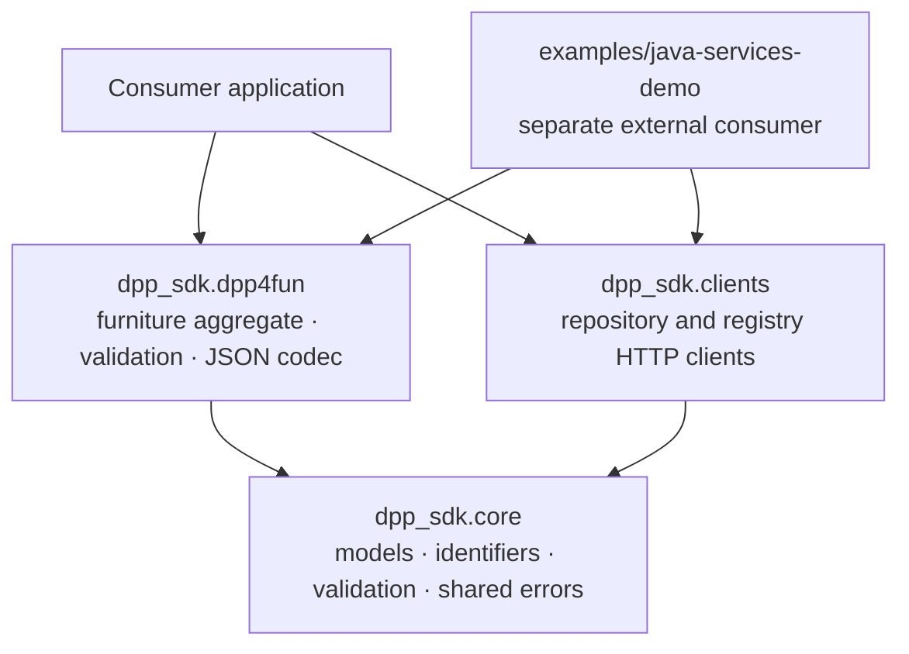

# Python SDK overview

## Purpose

`dpp-sdk` is a reusable Python client SDK for representing, validating, encoding, and exchanging
Digital Product Passport data. Its public surface is `dpp_sdk` for models and DPP4Fun helpers,
and `dpp_sdk.clients` for synchronous repository and registry clients.

This guide describes the package boundary. For consumer tasks, continue with the
[usage guide](usage.md), [models and validation](models-and-validation.md), and
[client guide](clients.md).

## Architecture at a glance

The editable diagram source is [python-sdk-architecture.mmd](diagrams/python-sdk-architecture.mmd).

## Public boundaries

| Area | Public responsibility | Source of truth |
| --- | --- | --- |
| `dpp_sdk.core` | Immutable core models, DPP/product identifiers, shared errors, semantic validation | `src/dpp_sdk/core/` |
| `dpp_sdk.dpp4fun` | Furniture aggregate models, extension validation, flat/nested JSON codec | `src/dpp_sdk/dpp4fun/` |
| `dpp_sdk.clients` | Synchronous HTTPX repository and registry clients, request/response models, client errors | `src/dpp_sdk/clients/` |
| `examples/java-services-demo` | Independently installed public-client demonstration against disposable Java images | `examples/java-services-demo/` |

`core` has no dependency on the DPP4Fun or client packages. DPP4Fun and the clients both consume
the reusable core contract; application code composes them.

## Data and validation flow

Model construction enforces structural constraints such as required fields, non-blank text,
unknown-field rejection, collection shape, and finite non-negative numeric values. Semantic rules
remain explicit: call `validate_dpp_core()` or `validate_dpp4fun()` after construction or parsing.
The validators are fail-fast and raise `DppValidationError` for the first applicable rule breach.

The DPP4Fun codec accepts its supported flat and nested JSON forms, maps them to `Dpp4Fun`, and
emits the interoperable flattened representation. Mapping failures use `DppMappingError`.

## Clients, configuration, and errors

`DppRepoClient` is generic over a caller-provided model codec and validator; `DppRegistryClient`
uses the public registration request and response models. Pass application endpoints explicitly in
production. The `for_local_mock()` constructors are local-development conveniences whose defaults
are derived from local endpoint environment variables.

Client failures are deliberately distinct from model failures: local validation, mapping,
network/timeout, non-success HTTP, and unsuccessful API-envelope responses map to their respective
`Dpp*ClientError` subclasses. See [Clients](clients.md) for the exact families and ownership rules.

## Examples and the Java-services demo

The [usage guide](usage.md) owns SDK-only examples. The
[Java-services demo](../examples/java-services-demo/README.md) is deliberately outside the import
package and is not included in the root distribution. It validates public-client interoperability
against pinned published Java images; it neither supplies a Python service implementation nor
expands the reusable SDK API.

The demo is maintained against Java repository and registry image version `0.5.0` and immutable
pinned image references. Its `0.4.0` profile is an optional legacy compatibility reference, not a
maintained compatibility commitment.

## Excluded scope

The package does not provide persistence, databases, repository or registry servers, Docker
orchestration, Spring application code, EDC/dataspace components, private registry integrations,
or internal service endpoints. Those concerns must not be inferred from the public Python clients.

Next: [SDK usage](usage.md).
