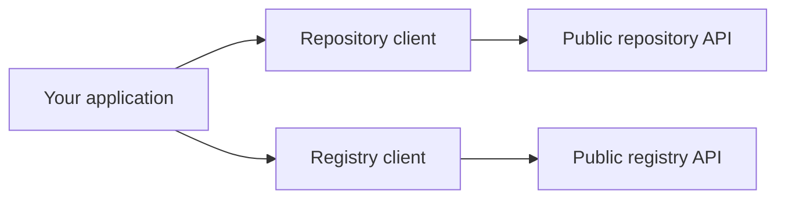

# DPP SDK clients module

## What this module does

Use `dpp_sdk.clients` when your application needs to talk to a public DPP repository or registry
API. It gives you two synchronous HTTP clients and the small request/response models they use.

- `DppRepoClient[T]` works with a complete passport of your chosen type `T`.
- `DppRegistryClient` registers passport metadata; it does not send the complete passport.
- Payload models are the request and response shapes used at the API boundary. You can also use
  them directly when your application has its own HTTP layer.

The module does not run a repository or registry. It does not provide authentication, retries,
asynchronous clients, persistence, internal registry APIs, lifecycle-event storage, or Docker
runtime support.

## How requests flow



*Diagram: use the repository client for a complete passport and the registry client for registration
metadata. Both clients call public services that your application provides as URLs.*

For a repository client, you tell the SDK how to check and convert your full passport to JSON. This
keeps the client usable with `Dpp4Fun` or with a model from your own application.

## Payload models: small API request and response objects

The SDK ships one `dpp-sdk` distribution. Its payload models are available from
`dpp_sdk.clients`; they are not separate installable packages. They keep JSON field names and the
standard response shape consistent between your application and a service. They do not contain a
complete DPP model, database code, or service logic.

| Group | Models | Use them for… |
| --- | --- | --- |
| Standard API response | `DppApiResponse`, `DppApiMessage`, `DppStatusCode`, `MessageType` | the service wrapper, status, and messages around a response |
| Repository | `CreateDppResponse`, `DeleteDppResponse`, `ReadDppIdsRequest`, `ReadDppIdsResponse` | create/delete results and batch product-ID lookup |
| Fine-grained compatibility | `UpdateDataElementRequest` | reading old compatibility code; normal fine-grained updates send the value directly |
| Registry | `RegisterDppRequest`, `RegisterDppResponse` | registering a passport and reading the registration receipt |

### Use payloads without the supplied clients

Use a payload model directly when your application owns the HTTP framework but needs the same JSON
shape as the SDK. For example, create a batch lookup request, send `outgoing_json` with your own
HTTP code, then validate the service reply:

```python
from dpp_sdk.clients import ReadDppIdsRequest, ReadDppIdsResponse


request = ReadDppIdsRequest(productIdentifiers=["GTIN-0001"], limit=25)
outgoing_json = request.model_dump_json()

# Your own HTTP code sends outgoing_json and receives incoming_json.
incoming_json = '{"dppIdentifiers": ["DPP-1"], "nextCursor": null}'
response = ReadDppIdsResponse.model_validate_json(incoming_json)
assert response.dppIdentifiers == ["DPP-1"]
```

`DppApiResponse` is the general service envelope. The supplied clients parse that envelope for you
and then return the useful typed result or JSON value. Use the envelope model directly only when
your own API integration needs to read or produce that wrapper itself.

## Set up a repository client

The repository client needs a base URL plus two small pieces supplied by your application:

- a codec that converts a complete passport to and from JSON;
- a validator that checks the passport before `create_dpp()` sends it.

`Dpp4FunJsonCodec` and `validate_dpp4fun` provide those pieces for the built-in furniture model:

```python
from dpp_sdk import Dpp4FunJsonCodec, validate_dpp4fun
from dpp_sdk.clients import DppRepoClient


with DppRepoClient(
    "https://repo.example.com",
    codec=Dpp4FunJsonCodec(),
    validator=validate_dpp4fun,
) as repository:
    healthy = repository.health_check()
```

The client checks a complete passport before creating it. It does not try to validate a partial
update or one selected value, because only the service can check the finished passport after that
change. A client created by the SDK is closed by `close()` or by leaving the `with` block. An HTTPX
client you inject remains caller-owned.

## Repository operations

| What you want to do | Method | What you get back |
| --- | --- | --- |
| Check whether the service responds | `health_check()` | `bool` |
| Create a complete passport | `create_dpp(dpp)` | `CreateDppResponse` with `dppId` |
| Read a complete passport by DPP ID | `read_dpp_by_id(dpp_id)` | `T` |
| Read a complete passport by product ID | `read_dpp_by_product_id(product_id)` | `T` |
| Read a compressed passport | `read_compressed_dpp_by_id(dpp_id)` | raw JSON value |
| Read an earlier version by DPP ID and time | `read_dpp_version_by_id_and_date(dpp_id, date)` | `T` |
| Look up DPP IDs for several product IDs | `read_dpp_ids_by_product_ids(product_ids, limit, cursor)` | `ReadDppIdsResponse` |
| Update a passport with a partial JSON value | `update_dpp_by_id(dpp_id, partial_dpp)` | `T` |
| Read one selected value | `read_data_element(dpp_id, element_path)` | raw JSON value |
| Update one selected value | `update_data_element(dpp_id, element_path, payload)` | raw JSON value |
| Delete a passport | `delete_dpp_by_id(dpp_id)` | `DeleteDppResponse` |

`read_dpp_version_by_product_id_and_date()` remains a deprecated compatibility route. It uses a
legacy unversioned route; new code should use the DPP-ID history route instead.

### Full, compressed, and selected-value reads

Full reads ask the service for a full representation and use your codec to return `T`. A compressed
read asks for a compressed representation and returns the JSON value without trying to turn it into
`T`. Historical dates must include a timezone; the client sends them in UTC.

For a selected value, pass the path and the value itself. Inside the `with` block above, this sends
the JSON string `"Updated element value"`; it does not wrap that string in another object:

```python
changed = repository.update_data_element(
    "DPP-1",
    "$.characteristics.productName",
    "Updated element value",
)
```

`UpdateDataElementRequest(payload=...)` remains importable for compatibility, but it does not
change the direct-body behavior of `update_data_element()`.

Both update methods prepare the body as strict JSON before making a request. Finite numbers,
strings (including Unicode), lists, objects, and `None` (JSON `null`) keep their normal JSON
representation. `NaN`, `Infinity`, `-Infinity`, and values JSON cannot represent, such as a
`set`, raise `DppMappingClientError` before any network request is sent. The original `ValueError`
or `TypeError` remains available as the exception cause.

### Technical route and path details

| Public operation family | Route |
| --- | --- |
| Create, full/compressed read, update, delete | `/v1/dpps` and `/v1/dpps/{dppId}` |
| Full read by product ID | `/v1/dppsByProductId/{productId}` |
| Full historical read | `/v1/dppsByIdAndDate/{dppId}?date={instant}` |
| Batch DPP-ID lookup | `POST /v1/dppsByProductIds` |
| Read or update one value | `/v1/dpps/{dppId}/elements/{elementPath}` |

The client percent-encodes DPP IDs, product IDs, and element paths. It sends an element path to the
service but does not evaluate it locally or claim complete RFC 9535 JSONPath support. The connected
Java demo supports a documented singular subset; its service-specific status behavior belongs to
the [Java-services demo](../../../examples/java-services-demo/README.md), not to the Python client.

## Register a passport

The registry client needs only the registry URL. Build a `RegisterDppRequest`, send it, and read the
`registrationId` returned by the service:

```python
from dpp_sdk.clients import DppRegistryClient, RegisterDppRequest


request = RegisterDppRequest(
    uniqueProductIdentifier="GTIN-0001",
    digitalProductPassportId="DPP-1",
    uniqueEconomicOperatorIdentifier="operator-123",
    dppApiEndpoint="https://repo.example.com",
)

with DppRegistryClient("https://registry.example.com") as registry:
    receipt = registry.post_new_dpp_to_registry(request)
    print(receipt.registrationId)
```

The SDK writes the current field names shown above and `registrationId`. It can read older input
names (`productIdentifier`, `dppIdentifier`, `operatorIdentifier`, `repoUrl`, and
`registryIdentifier`) so existing data can still be read. Those older names are not emitted as new
JSON. The registry contract has no backup-operator field. Public registry read-back, cleanup, and
internal lifecycle operations are not client methods.

## Errors and boundaries

All client errors extend `DppClientError`:

| Error | Meaning |
| --- | --- |
| `DppValidationClientError` | a complete passport failed the check before create is sent |
| `DppMappingClientError` | JSON could not be prepared or read as the expected shape |
| `DppNetworkClientError` | a connection or timeout prevented the HTTP request |
| `DppHttpClientError` | the service returned a non-2xx HTTP response; it includes status and body |
| `DppApiClientError` | the HTTP response was successful but its API status reported an error |

The clients call documented public service APIs. They do not provide service-side behavior,
authentication, caching, retries, asynchronous APIs, or a production-operational guarantee.
Compression is project-defined, and the module does not claim complete RFC 7396 JSON Merge Patch
or RFC 9535 JSONPath support. Java demo `/internal/...` routes are intentionally not Python client
operations.

## Build and test locally

This module is part of the single `dpp-sdk` distribution; it is not a separately buildable or
published package. Run commands from the repository root.

PowerShell:

```powershell
python -m pip install -e ".[dev,release]"
python -m build
python -m pytest tests/test_clients.py tests/test_end_to_end.py
```

Linux/macOS:

```bash
python -m pip install -e ".[dev,release]"
python -m build
python -m pytest tests/test_clients.py tests/test_end_to_end.py
```

`python -m build` builds the complete SDK distribution. Controlled HTTP tests are deterministic;
live Java-image interoperability belongs to the separately installed
[Java-services demo](../../../examples/java-services-demo/README.md).
