# DPP SDK core module

## Purpose

`dpp_sdk.core` is the reusable part of the SDK. Use it when you need the common passport details:
identity, nameplate information, organisations and contacts, documentation, and validation. The
furniture-specific DPP4Fun module builds on these models. Generic clients can work with any model
that an application knows how to convert and check.

It does not provide a standalone JSON codec, furniture-specific models, HTTP clients, repository or
registry services, persistence, or lifecycle-event storage.

## Architecture at a glance



*Diagram: core owns reusable frozen models, explicit core validation, and shared errors. DPP4Fun
uses this boundary without creating a reverse dependency.*

All public models are frozen Pydantic models. Construction checks the shape of the data; call
`validate_dpp_core()` when you want to check the business rules as well.

## Public surface

| Need | Public types or function |
| --- | --- |
| Passport identity and update dates | `PassportMetadata` |
| Product identity and economic operators | `Nameplate`, `Organization`, `OrganizationRole` |
| Contact details | `Contact`, `Address`, `Email`, `Telephone` |
| Optional user documentation | `Documentation` |
| Reusable aggregate | `DppCore`, `Dpp` |
| Explicit semantic checks | `validate_dpp_core()` |
| Shared failures | `DppError`, `DppValidationError`, `DppMappingError` |

The stable identifiers are exposed by a concrete `Dpp` aggregate: `dpp_id` is the string form of
`uniqueProductIdentifier`; `product_id` is `gtinCode`.

For the canonical field/default/null table, use the repository [model guide](../../../docs/model-guide.md).
For semantic validator order, null behavior, and error paths, use the [validation-rule reference]
(../../../docs/validation-rules.md).

## Practical usage

```python
from datetime import date
from uuid import UUID

from dpp_sdk.core import (
    DppCore,
    Nameplate,
    Organization,
    OrganizationRole,
    PassportMetadata,
    validate_dpp_core,
)

core = DppCore(
    passportMetadata=PassportMetadata(
        uniqueProductIdentifier=UUID("11111111-1111-1111-1111-111111111111"),
        passportUpdateDates=(date(2026, 6, 29),),
    ),
    nameplate=Nameplate(
        gtinCode="04012345678901",
        manufacturer=Organization(
            name="Cir4Fun Furniture GmbH",
            role=OrganizationRole.MANUFACTURER,
        ),
    ),
)
validate_dpp_core(core)
```

Construction rejects structurally invalid data such as missing required fields, unknown fields,
blank required text, blank optional text when present, and negative count values. Semantic
validation is fail-fast and raises `DppValidationError` for the first applicable rule breach.

## Immutable updates

Use `with_updates()` to create a structurally revalidated replacement; it never mutates the
original model:

```python
updated_nameplate = core.nameplate.with_updates(gtinCode="04012345678902")
updated_core = core.with_updates(nameplate=updated_nameplate)
assert core.nameplate.gtinCode == "04012345678901"
assert updated_core.nameplate.gtinCode == "04012345678902"
```

Do not use unchecked `model_copy(update=...)` as a public update mechanism, because it can bypass
the normal structural construction boundary.

## Validation and transport boundary

Core model fields retain their camelCase JSON names. UUID values serialize canonically and dates
serialize as ISO dates. The aggregate-level DPP4Fun codec owns flattened versus nested JSON
transport; there is no standalone core JSON codec.

Required text must not be null or contract-blank. Optional text can be null but cannot be
contract-blank when present; accepted text is not trimmed. The contract uses a frozen Unicode
whitespace table: U+200B remains visible text rather than blank. For aggregate, numeric, list, BOM,
and codec rules, see the [DPP4Fun module](../dpp4fun/README.md).

## Build and test locally

**Purpose:** run focused core model/validator checks. **Run from:** repository root.
**Prerequisites:** the checkout development environment. The [release guide](../../../RELEASING.md)
owns installation, full validation, builds, archive inspection, and cleanup.

### PowerShell

```powershell
python -m pytest tests/test_core_model.py tests/test_core_validation.py
```

### Linux/macOS

```bash
python -m pytest tests/test_core_model.py tests/test_core_validation.py
```

**Expected result:** focused structural and semantic core tests pass. **Cleanup:** none.

## Boundaries and limitations

- No concrete DPP aggregate is supplied by this module; use DPP4Fun or another consumer-owned
  aggregate over `Dpp`.
- No semantic validation runs implicitly during every parse or update. Call the explicit validator
  when semantic validity is required.
- No HTTP, service, persistence, Docker, Spring, EDC, or standards-certification capability is
  provided here.

Next: [DPP4Fun module](../dpp4fun/README.md) or [SDK usage](../../../docs/usage.md).
