# DPP SDK DPP4Fun module

## Purpose

`dpp_sdk.dpp4fun` adds the furniture information to a reusable passport. Use it when your product
is furniture and you want the ready-made `Dpp4Fun` model, its checks, and its JSON conversion. It
uses the reusable core models and does not depend on repository or registry clients.

It does not implement a generic DPP standard for every product sector, an HTTP service, persistence,
or a standalone reusable-core JSON codec.

## Architecture at a glance



*Diagram: a DPP4Fun passport combines a core passport with furniture details and an optional Bill
of Materials. Validation is explicit; JSON transport is a separate flat/nested mapping boundary.*

The models are frozen Pydantic models. Contracted collections are immutable tuples in memory and
JSON arrays on the wire.

## Public surface

| Need | Public types or function |
| --- | --- |
| Complete furniture passport | `Dpp4Fun` |
| Classification and characteristics | `ProductClassification`, `Characteristics`, `Dimensions` |
| Bill of Materials | `BillOfMaterials`, `Material`, `Component`, `Part` |
| JSON codec | `Dpp4FunJsonCodec`, `to_json()`, `from_json()`, `from_json_and_validate()` |
| Explicit semantic checks | `validate_dpp4fun()` |

`Dpp4Fun` inherits the core identifier accessors: `dpp_id` and `product_id`.

The repository [model guide](../../../docs/model-guide.md) owns the complete DPP4Fun and Bill of
Materials field/default/null tables. The [validation guide](../../../docs/validation-guide.md) and
[validation-rule reference](../../../docs/validation-rules.md) own the explicit validation and
codec failure boundary.

## Practical usage

The root [SDK usage guide](../../../docs/usage.md) owns the complete construction walkthrough. This
module example shows the aggregate codec and explicit validation boundary:

```python
from dpp_sdk.dpp4fun import from_json, to_json, validate_dpp4fun

raw = """{
  "passportMetadata": {
    "uniqueProductIdentifier": "11111111-1111-1111-1111-111111111111",
    "passportUpdateDates": ["2026-06-29"]
  },
  "nameplate": {
    "gtinCode": "04012345678901",
    "manufacturer": {"name": "Cir4Fun Furniture GmbH", "role": "MANUFACTURER"}
  },
  "classification": {"sector": "Furniture", "category": "Seating", "tags": []},
  "characteristics": {"productName": "ErgoChair", "features": []}
}"""

dpp = from_json(raw)  # structural mapping only
validate_dpp4fun(dpp)  # explicit semantic validation
outgoing_json = to_json(dpp)  # canonical flattened output
assert from_json(outgoing_json) == dpp
```

`from_json_and_validate()` is available when an application needs those two stages together.

## Immutable updates

```python
updated = dpp.with_updates(
    characteristics=dpp.characteristics.with_updates(productName="ErgoChair Pro")
)
validate_dpp4fun(updated)
assert dpp.characteristics.productName == "ErgoChair"
```

Use `with_updates()` rather than unchecked `model_copy(update=...)` for public updates.

## JSON and validation behavior

Outbound JSON flattens `passportMetadata`, `nameplate`, and optional `documentation` from
`coreDpp`. Inbound mapping accepts that flat shape and the supported nested `coreDpp` shape. Mapping
does not implicitly apply semantic validation.

`from_json()` rejects non-object roots, null roots, malformed structure, null list members, and
non-finite JSON numeric values through `DppMappingError`. Semantic validation is fail-fast through
`DppValidationError` and includes core, classification, characteristics, Bill of Materials, and
cross-object rules.

Required and optional text follow the core module's frozen Unicode-whitespace contract; U+200B is
visible text rather than blank. Dimensions, material portions, and weight must be finite and
non-negative. `tags` and `features` require clean string members: a JSON null member is a mapping
failure, while defensive semantic validation reports an indexed error. Validation checks core,
classification, characteristics, Bill of Materials, and cross-rules in fail-fast order; each BOM
member is validated before duplicate/reference and aggregate rules are applied.

Failure stages stay distinct: Pydantic construction rejects invalid model shape, explicit semantic
validation raises `DppValidationError`, and JSON normalization or model mapping raises
`DppMappingError`. Consumers should not rely on a fail-fast validator to accumulate every defect.

## Build and test locally

**Purpose:** run focused furniture-model, validation, and codec checks. **Run from:** repository
root. **Prerequisites:** the checkout development environment. The
[release guide](../../../RELEASING.md) owns installation, full validation, builds, archive
inspection, and cleanup.

### PowerShell

```powershell
.\.venv\Scripts\python.exe -m pytest tests/test_dpp4fun_validation.py tests/test_transport_roundtrip.py tests/test_end_to_end.py
```

### Linux/macOS

```bash
.venv/bin/python -m pytest tests/test_dpp4fun_validation.py tests/test_transport_roundtrip.py tests/test_end_to_end.py
```

**Expected result:** focused model, validation, and transport tests pass. **Cleanup:** none.

## Boundaries and limitations

- The DPP4Fun contract is furniture-specific; it is not a generic model for every DPP sector.
- The codec supports the documented flat and nested input forms only; it does not accept arbitrary
  JSON or return a nullable root value.
- The module does not implement HTTP clients, repositories, registries, persistence, Docker, Spring,
  EDC, or standards certification.

Next: [Clients module](../clients/README.md) for public HTTP consumers, or
[SDK usage](../../../docs/usage.md) for the complete consumer path.
